# AuraScan

A SwiftUI iOS app that performs multimodal astrological and energetic readings across four modalities:

| Modality | Tradition | What it reads |
|---|---|---|
| **Face** | Physiognomy + planetary correspondence | Forehead/Jupiter, brows/Mars, eyes/Sun–Moon, jaw/Saturn, symmetry |
| **Coffee cup** | Tasseography | Rim = immediate, walls = present, base = future/root, handle = self |
| **Palm** | Chiromancy | Major/minor lines, mounts, elemental hand shape |
| **Space** | Feng Shui + Vastu Shastra | Command position, brahmasthan, flow, lighting, five-phase balance |

A photo is captured (or picked), sent to a multimodal vision model with a modality-specific system prompt and a JSON Schema, and the strictly validated response is rendered as an interactive reading and saved to local history.

---

## Requirements

- Xcode 16+, iOS 17.0 deployment target, Swift 6 (strict concurrency: `complete`)
- [XcodeGen](https://github.com/yonaskolb/XcodeGen) — the `.xcodeproj` is generated, not committed

```bash
git clone -b claude/aurascan-ios-app-wzxp9n \
  https://github.com/Meet2147/DestinyAPI.git AuraScan-repo
cd AuraScan-repo/AuraScan
./bootstrap.sh --open      # or --build / --test
```

`bootstrap.sh` installs XcodeGen if it is missing, generates
`AuraScan.xcodeproj` from `project.yml`, and picks whichever iPhone simulator
is actually installed rather than pinning a device name.

Then run the app, open **Settings**, pick a provider, and paste an API key. The key is written to the iOS Keychain (`kSecAttrAccessibleAfterFirstUnlockThisDeviceOnly`) and never leaves the device except in requests to that provider. For simulator convenience, a DEBUG build also reads `AURASCAN_API_KEY` from the scheme environment.

> **Production note:** shipping a provider API key inside an app binary is not safe, because a key on a user's device is a key you have given away. For a real release, point `AnthropicProvider(baseURL:)` (or its siblings) at a relay you control and keep the key server-side. `SecretStore` exists so a developer build can run standalone.

---

## Design

### Visual language — "Soft Depth"

Neumorphism, adapted rather than adopted. Classic soft UI extrudes every surface
from one flat ground, which on a dark background leaves the light shadow nowhere
to go and drags body text down to roughly 3:1 contrast. AuraScan is dark and
photo-first, so depth is applied **only to chrome** — anything you can tap, drag
or read a value off — while content stays at full contrast.

The rule when adding a control (`Core/DesignSystem/SoftDepth.swift`):

| The element | Treatment |
|---|---|
| Responds to touch | `.softRaised(…)`, pressing to a recessed state |
| Holds a value or a track | `.softRecessed(…)` — a well |
| Carries text to be read | `GlassCard` — no depth |

Light comes from the top-left everywhere, so every extrusion in the app agrees
about where the sun is. Pressing a control genuinely inverts its extrusion
rather than just dimming it: the shutter, the primary button and the history
filter pills all sink into the ground.

`Design/Screens/mockups.html` reproduces these tokens in CSS so the mockups and
the SwiftUI build cannot drift apart silently.

### Screens

Capture and result are shown for all four modalities, since the guide overlay,
the accent theming and the zone vocabulary all change per modality.

**Shared flow**

| | | | |
|---|---|---|---|
| 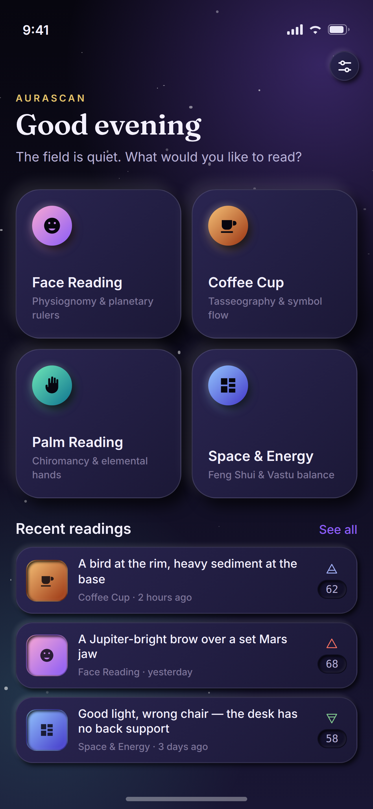 | 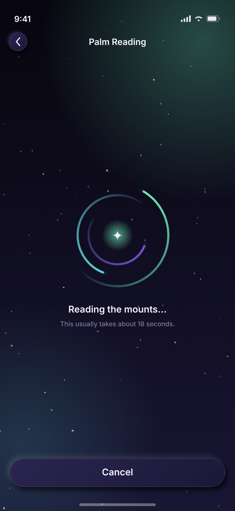 | 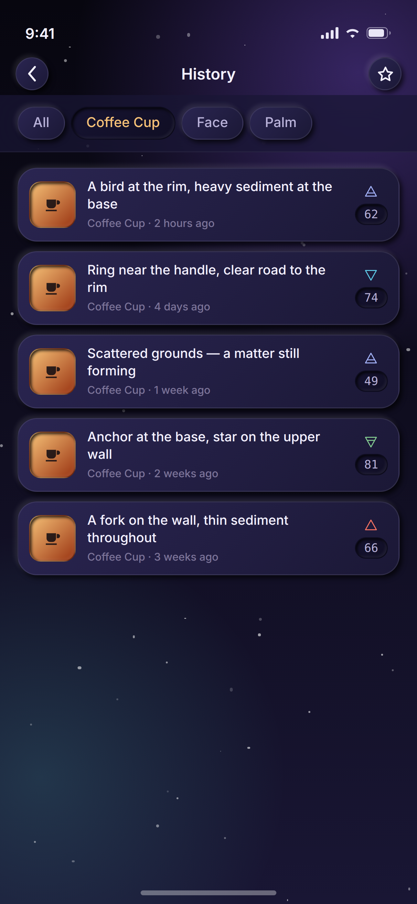 | 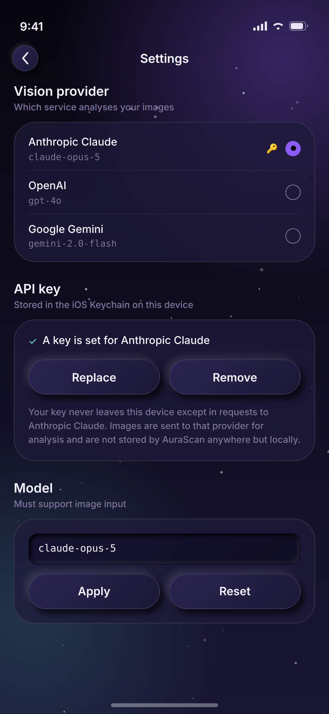 |
| Dashboard | Analysing | History | Settings |

**Per modality — capture, then reading**

| | | | |
|---|---|---|---|
| 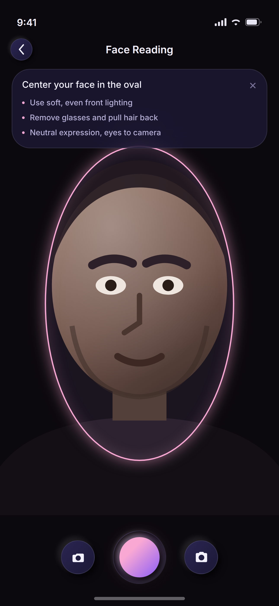 | 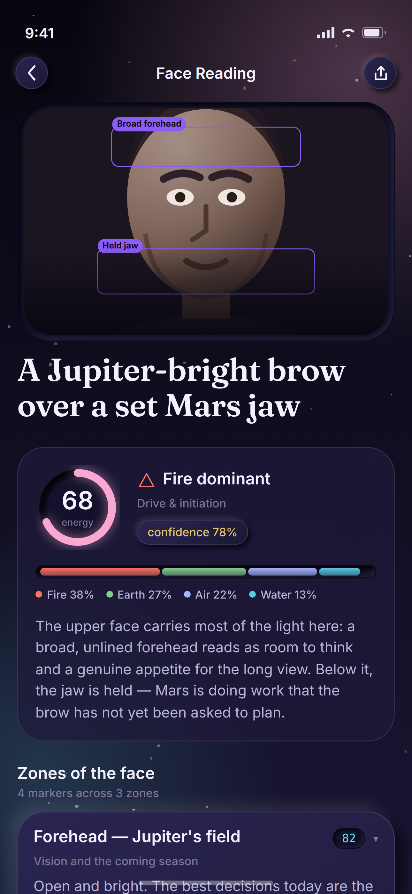 | 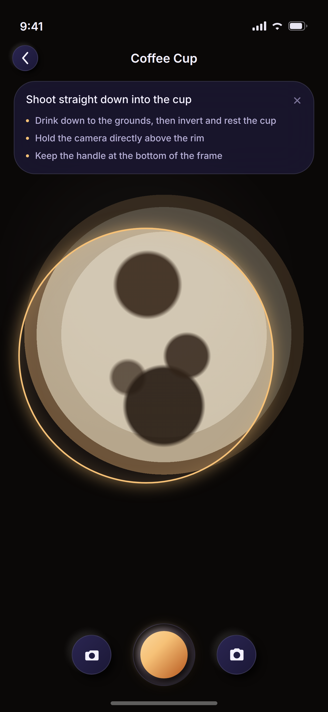 | 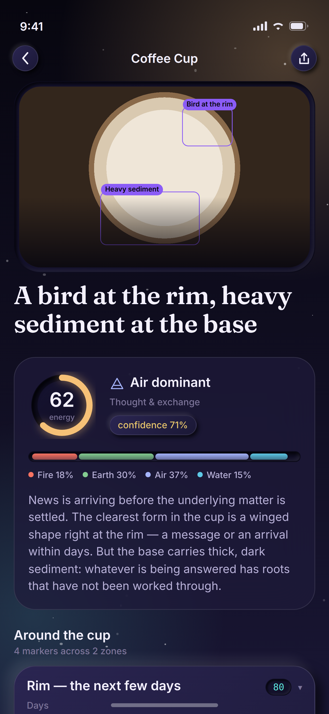 |
| Face — oval guide | Face — reading | Coffee — circle guide | Coffee — reading |
| 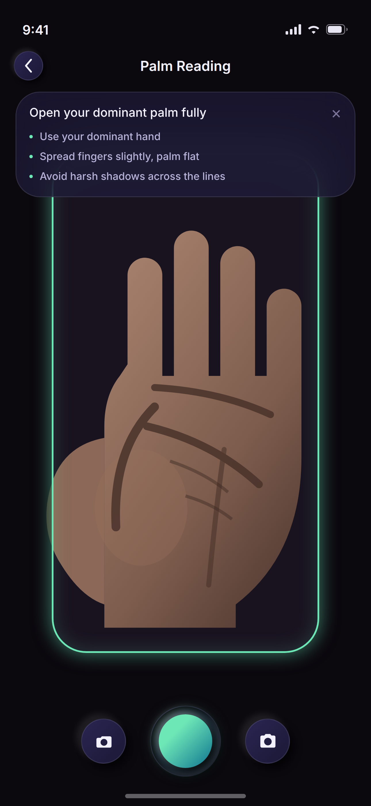 | 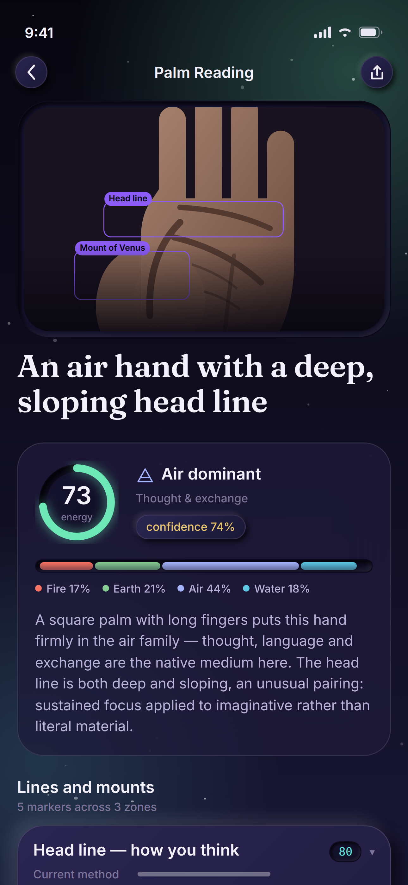 | 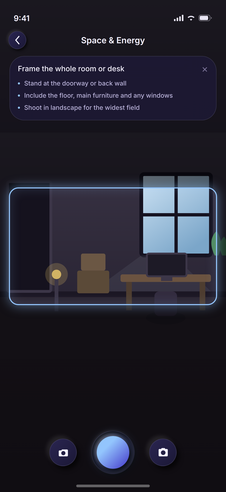 | 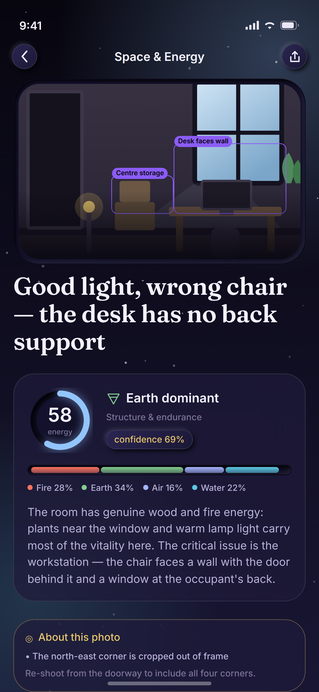 |
| Palm — hand guide | Palm — reading | Space — wide frame | Space — reading, with image-quality notice |

Guide geometry in the mockups mirrors `ModalityType.guideShape`, and every
reading's copy is lifted verbatim from `Core/Utilities/SampleData.swift`, so the
screens show what the app actually ships rather than invented marketing text.

These are **design mockups, not simulator captures** — rendered from
`Design/Screens/mockups.html` via headless Chromium at 1290×2796 (an exact App
Store 6.9" screenshot size). The subjects (face, palm, room) are stylised SVG
illustrations: a mockup that pretends to be a photograph reads as a bad
photograph. Regenerate with:

```bash
cd Design/Screens && node shoot.mjs
```

Type is Fraunces (display) and Inter (UI) in the mockups, standing in for the
system serif and SF Pro that the app actually uses on device.

### Logo

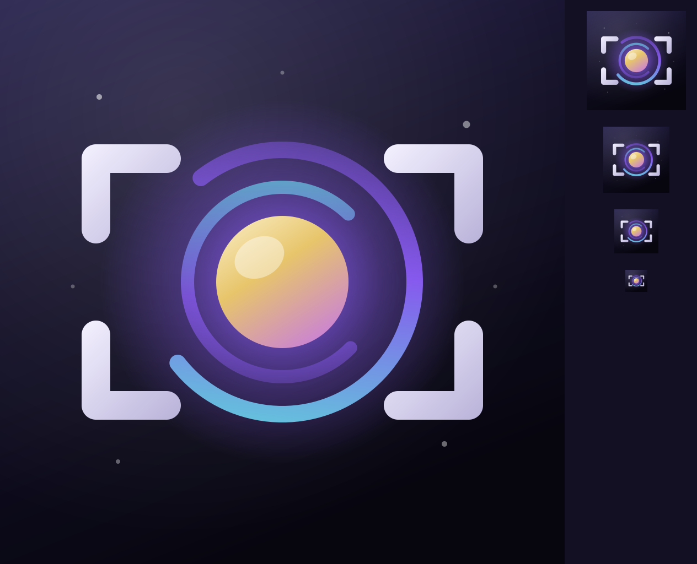

An aura orb held inside four capture brackets — the brackets deliberately echo
`CaptureGuideOverlay`, so the icon and the viewfinder read as the same product.
Authored as SVG (`Design/Logo/aurascan-icon.svg`) and rasterised into
`AuraScan/Resources/Assets.xcassets/AppIcon.appiconset`, including the iOS 18
dark and tinted variants. Regenerate after editing the SVG:

```bash
cd Design/Logo && python3 -c "
import cairosvg
for n in ('aurascan-icon','aurascan-icon-dark','aurascan-icon-tinted'):
    cairosvg.svg2png(url=f'{n}.svg', write_to=f'{n}-1024.png', output_width=1024, output_height=1024)"
```

Every stroke is at least 12px at 1024 so the mark survives being 40pt on a home
screen; `contact-sheet.png` shows it at 1024, 180, 120, 80 and 40.


## Architecture

MVVM with a service layer. Views hold no networking, persistence, or AVFoundation code; `AppEnvironment` is the composition root and the only place concrete services are constructed.

```
Capture (UIImage)
   ↓  ImageProcessor        downscale → JPEG → base64
   ↓  AstrologyPrompts      modality system prompt + user turn
   ↓  AnalysisSchema        JSON Schema pinned to the modality's zone vocabulary
   ↓  AIProvider            Anthropic | OpenAI | Gemini  (HTTP only)
   ↓  VisionAnalysisService retry w/ backoff → extract JSON → decode → repair once
   ↓  ReadingRepository     SwiftData
   ↓  ReadingResultView
```

### File structure

```
AuraScan/
├── project.yml                          XcodeGen spec (source of truth)
├── AuraScan/
│   ├── App/
│   │   ├── AuraScanApp.swift             @main, container + environment wiring
│   │   ├── AppEnvironment.swift          composition root, provider selection, previews
│   │   └── RootView.swift                NavigationStack + Route enum
│   ├── Core/
│   │   ├── DesignSystem/
│   │   │   ├── SoftDepth.swift           neumorphic raised/recessed modifiers
│   │   │   ├── Theme.swift               palette, type scale, GlassCard, AuraButtonStyle, Chip
│   │   │   ├── CosmicBackground.swift    gradient + seeded star field
│   │   │   └── ElementBalanceBar.swift   stacked elemental bar, EnergyGauge
│   │   ├── Extensions/                   Color+Hex, Comparable+Clamped, Date+Display
│   │   └── Utilities/SampleData.swift    canned readings for previews and tests
│   ├── Domain/Models/
│   │   ├── ModalityType.swift            modalities, theming, capture guides, zone vocabulary
│   │   ├── Element.swift                 Element, Planet, Polarity (tolerant decoding)
│   │   ├── AnalysisResponse.swift        the structured reading payload
│   │   ├── AnalysisSchema.swift          JSON Schema mirroring AnalysisResponse
│   │   └── ReadingModel.swift            SwiftData @Model
│   ├── Services/
│   │   ├── AI/
│   │   │   ├── AIProvider.swift          transport protocol, request/response, error taxonomy
│   │   │   ├── HTTPClient.swift          URLSession + status→error mapping
│   │   │   ├── AnthropicProvider.swift   Messages API, output_config.format, prompt caching
│   │   │   ├── OpenAIProvider.swift      Chat Completions, response_format json_schema
│   │   │   ├── GeminiProvider.swift      generateContent + schema sanitiser
│   │   │   ├── VisionAnalysisService.swift  orchestration, retry, JSON extraction, repair
│   │   │   ├── ImageProcessor.swift      resize/encode/thumbnail
│   │   │   └── SecretStore.swift         Keychain-backed API keys
│   │   ├── Camera/
│   │   │   ├── CameraManager.swift       AVCaptureSession, async photo capture
│   │   │   └── CameraPreviewView.swift   AVCaptureVideoPreviewLayer + tap-to-focus
│   │   ├── Persistence/
│   │   │   ├── ReadingRepository.swift   SwiftData CRUD
│   │   │   └── ModelContainer+AuraScan.swift
│   │   └── Prompts/AstrologyPrompts.swift  the four system prompts
│   ├── Features/
│   │   ├── Dashboard/  HomeDashboardView + ViewModel
│   │   ├── Capture/    CaptureView, CaptureViewModel, CaptureGuideOverlay
│   │   ├── Analysis/   AnalyzingView, CosmicLoader
│   │   ├── Result/     ReadingResultView, ShareCardView
│   │   ├── History/    HistoryView
│   │   └── Settings/   SettingsView
│   └── Resources/
│       ├── Info.plist
│       └── Assets.xcassets/              AppIcon (light/dark/tinted), colours, AuraMark
├── Design/
│   ├── Logo/                             icon SVG masters + rendered PNGs
│   └── Screens/                          mockups.html, shoot.mjs, screenshot PNGs
└── AuraScanTests/                        Swift Testing suites
```

## Design notes

**Prompts and schema share one vocabulary.** `ModalityType.zoneVocabulary` is the single source of truth for zone keys. `AnalysisSchema` pins the `zone` field to that enum, and every system prompt quotes it. `SchemaAndPromptTests` fails the build if the three ever drift apart — the failure mode that would otherwise be silent.

**Observation is separated from interpretation.** Every marker carries both an `observation` (what is literally visible) and an `interpretation` (what the tradition makes of it). The prompts call this the most important instruction they contain; it is what keeps the model from inventing markers that suit a satisfying reading.

**Decoding is strict but forgiving in the right places.** The schema is enforced server-side where the provider supports it. On top of that, the decoder tolerates casing and whitespace drift in enums, normalises the four element scores to sum to 100, clamps out-of-range numbers, and synthesises marker ids — while still rejecting an element it does not recognise. A schema miss triggers exactly one repair round trip; an image the model called unreadable does not.

**Adding a fifth modality** means extending `ModalityType` (title, icon, gradient, guide shape, tips, zone vocabulary) and adding a briefing to `AstrologyPrompts`. Nothing else has a per-modality branch.

## Tests

`AuraScanTests` uses Swift Testing and covers the parts most likely to break silently:

- decoding well-formed, messy, and hostile model output
- element-balance normalisation and score clamping
- JSON extraction from fenced, prose-wrapped, and brace-in-string responses
- schema ↔ prompt ↔ model vocabulary agreement, per modality
- provider response parsing (thinking blocks, refusals, truncation) and retry classification

```bash
xcodebuild test -scheme AuraScan -destination 'platform=iOS Simulator,name=iPhone 16'
```

## Disclaimer

AuraScan offers reflective interpretation from traditional practices. It is not medical, psychological, legal or financial advice. The prompts explicitly forbid the model from inferring identity characteristics or predicting health, lifespan, legal or financial outcomes.
